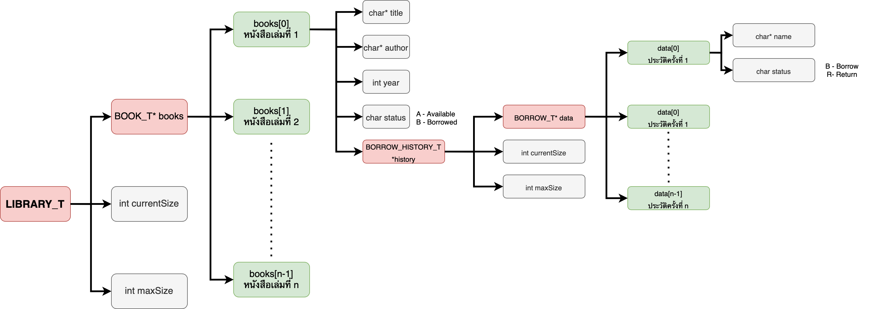

# CPE Library Management System
CPE100 Final Project 


## Members

| Name                         | Student Number      |
| ---------------------------- | ------------------- |
| `Chaiyapat Meeying`          | 65070501073 |
| `Pattaranun Ayaprasitphol`   | 65070501082  |
| `Panurut Sirinapaisan`       | 65070501083  |

## Table of Contents
1. [Struct](###Struct)
2. [Feature](###Feature)
3. [Structure Diagram](###Structure-Diagram)
4. [Function](###File-and-it's-Function)

### Struct
- BORROW_T
```c
typedef struct {
  char *name;
  char status;
} BORROW_T;
```
- BORROW_HISTORY_T
```c
typedef struct {
  BORROW_T *data; 
  int currentSize;
  int maxSize;
} BORROW_HISTORY_T;
```
- BOOK_T
```c
typedef struct {
  char *title;
  char *author;
  int year;
  char status;
  BORROW_HISTORY_T *history;
} BOOK_T;
```
- LIBRARY_T
```c
typedef struct {
  BOOK_T *books; 
  int currentSize;
  int maxSize;
} LIBRARY_T;
```

## Structure Diagram

<p align="center">
   
    Diagram
</p>


## Feature
- Add Book in the Library
- Remove Book in the Library
- Edit Book in the Library
- Search Book in the library
- Borrow the Book
- Return the Book


## File and it's Function
- ## Books.txt [Database file]
  ```
  10 ***number of the book in the file***
  test1 kiki 2000 A 0 0
  Harry$Potter JK$Rowling 1999 B 1 2 PANURUT$SIRNAPAISAN B
  (*name author year status currentHistory maxHistory borrower status *)
    .
    .
    .
  test10 eiei 2004 A 0 0
  ```

- ## main.c
   This is the project's main file that calls the function from another file book.c & library.c

- ## book.h
  This header file contains declarations for functions of book.c

- ## book.c
  This file contains the utility function and main function of book/library management to add, remove, edit, show, search, borrow, and return books in the library.
- #### Utilities Function
  These function are used for getting and validating user input
  - getString
  - getYear
  - isNumber
  - isBlank
  - findIndexByTitle
- bookCreate
  ```c
  BOOK_T *bookCreate();
  ```
  > Use to allocate memory for a pointer to struct `BOOK_T` and detail of a book 
- AddBook
  ```c
  void AddBook(LIBRARY_T *library);
  ```
  > - Call function `bookCreate` to allocate memory for a book
  > - Call function `getString`/`getYear` to get detail of the book (title,author,publish year)
  > - Call `SaveFile` function to save  file

- RemoveBook
  ```c
  void RemoveBook(LIBRARY_T *library);
  ```
   > - Call the `getString` function to get the book title the user wants to remove the data.
- EditBook
  ```c
  void EditBook(LIBRARY_T *library); 
  ```
  > - Call the `getString` function to get the book title the user wants to edit.
  > - Call the `getString` function to get detail of the book, and the user can leave it blank to retain the old value
- SearchBook
  ```c
  void SearchBook(LIBRARY_T *library);
  ```
  > - Call the `getString` function to get the book title / the book author
  > - Return the result that matches the search

- BorrowBook
  ```c
  void BorrowBook(LIBRARY_T *library);
  ```
  > - Call the `getString` function to get the borrower's name, then get the title of a book that the user wants to borrow
  > - Find the book by title by `findIndexByTitle` function. If it does not exist, Return not found
  > - Change borrow status to `'B'` means Borrowed

- ReturnBook
  ```c
  void ReturnBook(LIBRARY_T *library);
  ```
  > - Call the `getString` function to get the book title the user wants to return.
  > - Find the book by title by `findIndexByTitle` function. If it does not exist, Return not found
  > - Change borrow status to `'A'` means Available
  
- ## library.h
This header file contains declarations for functions, variables, type struct, and message of library.c

- ## library.c
   This file is the main library management. It has the call function `SelectMenu` for reading and writing the file and reallocating memory in the library.

- convertSpacetoDollarSign
  ```c
  void convertSpacetoDollarSign(char *str);
  ```
  > - This is a utility function to covert space to `'$'` character because we've decided to format space that the user inputs to `'$'`

- convertDollarSigntoSpace
  ```c
  void convertDollarSigntoSpace(char *str);
  ```
  > - This is a utility function to covert `'$'` character space

- SelectMenu
  ```c
  void SelectMenu(LIBRARY_T *library);
  ```
  > - A function is the program's main menu and allows the user to select from options by entering a number 1-8. The options include:
  >    - Adding a book.
  >    - Removing a book.
  >    - Editing a book.
  >    - Showing all books.
  >    - Searching for a book.
  >    - Borrowing a book.
  >    - Returning a book.
  >    - Exiting the program.
  
- createlibraryFromFile
  ```c
  LIBRARY_T *createlibraryFromFile(char *path);
  ```
  > - The function creates a library by reading in data from the file specified by the path argument and returns a pointer to a `LIBRARY_T` struct.
  > - Read each book in a file and store it in struct `BOOK_T`
  > - Read Borrow history and store it in struct `BORROW_HISTORY_T`
  > - Append book records to the library by `libraryAppend` function

- saveFile
  ```c
  void SaveFile(char *path, LIBRARY_T *library);
  ```
  > - Function opening the file for write, copy the title and author strings from the library to local variables title and author, then converts any spaces in these strings to dollar signs using the `convertSpacetoDollarSign` function. And then writes the title, author, year, status, and the current size of the borrowing history record

- libraryCreate
  ```c
  LIBRARY_T *libraryCreate(int initialCapacity);
  ```
  > - It is used to allocate memory for stored data in `LIBRARY_T` struct.

- libraryAppend
  ```c
  void libraryAppend(LIBRARY_T *library, BOOK_T *value);
  ```
  > -  Check the size of a library. If the size is not enough to keep the book, expand it by `libraryExpand` function, then store new data of the book and append it into the `LIBRARY_T` struct

- libraryExpand
  ```c
  void libraryExpand(LIBRARY_T *library);
  ```
  > -Allocate memory for old stored data and allocate memory for new data with new size by (old.maxSize*2), then copy the old data value to new data.
    
- libraryShowBookDetail
  ```c
  void libraryShowBookDetail(LIBRARY_T *library, int index);
  ```
  > - Print detail of the book such as Title of the book, Author of the book, Publish year, Book status, Borrow history
    
- libraryDestroy
  ```c
  void libraryDestroy(LIBRARY_T *library);
  ```
  > - Free the memory that allocates stored data before exiting the program
